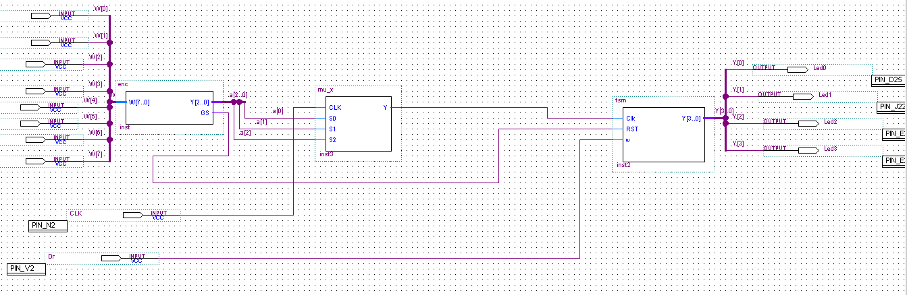

# **LAB 7 Extra Work.**
### FSM-based stepper motor control
***
**Objective:**
Designing a digital system to drive the **55SI-25 DAWC stepper motor** with eight different speed inputs from the DE2 board (SW0-SW7)in addition to a direction input (SW17).

The FSM diagram used as stepper motor driver is: 

> The main file is a zip file "Stepper.zip" which contains all the modules used.
#### **THE WORK:**
- **the 7244 IC** used in order to protect digital components and to improve noise rejection.
- **ULN2004A IC** used for interfacing between the circuit board and the Stepper Motor.
1. We start by Designing the block diagram of the FPGA based system, each componenet is implemented separatly from the main project "stepper",
the system is composed of 4 main blocks:

    * *8:3 Priority encoder*: under file name "enc", which its inputs are from the switches (0-7) and their outputs are connected to the inputs selections of the 8:1 MUX.
    * *8:1 Multiplexer*: under file name "mu_X", its inputs are the outputs of the clock Divier, and it is used to select the desired speed of the motor.
    * *Clock Divider*: there is no separate file for the clock divider, it was directly implemented in the multiplexer code, the mux have an input of the clock signal (50Mhz).
    * *FSM*: under file name "fsm", for a stepper motor driver.

2. After that we write the code description of every part and generating its symbol file on The Quartus II software.

3. combining this symbol files in the main file "stepper",implementing the global design on The Block-Diagram-File (BDF) and performing the simulation, we obtain the following diagram.

4. assigning ports, and downlaoding the model into the DE2 board and testing its functionalities, and everything worked perfectly.
> The DE2 board used contains the Cyclone II FPGA EP2C35F672C6.
